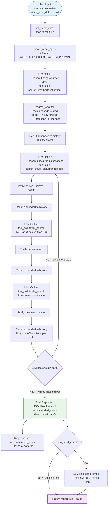
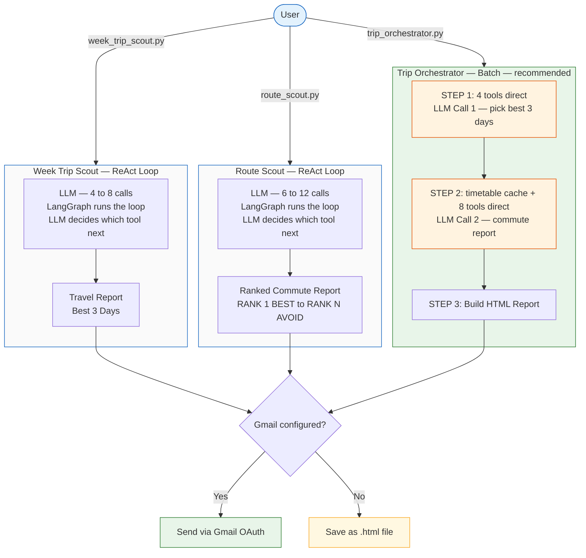

# System Diagrams — Agentic AI Travel Planner

All diagrams use Mermaid syntax. Render in VS Code (Mermaid Preview extension), GitHub, or any Mermaid-capable viewer.

---

## Diagram 1 — Week Trip Scout (ReAct Loop)

---

## Diagram 2 — Route Scout (ReAct Loop)

```mermaid
flowchart TD
    A(["User Input
source · destination
date · preferred_mode"]) --> B

    B["create_react_agent
9 tools · ROUTE_SCOUT_SYSTEM_PROMPT"] --> C

    C["LLM Call #1
Reason: check main rail line
tool_call: check_nj_transit_status()"]

    C --> T1["Tavily: NE Corridor alerts"]
    T1 --> H1["Appended to history"]

    H1 --> C2["LLM Call #2
tool_call: check_path_status()"]
    C2 --> T2["Tavily: PATH status"]
    T2 --> H2["Appended"]

    H2 --> C3["LLM Call #3
tool_call: check_nyc_subway_status()"]
    C3 --> T3["Tavily: MTA alerts"]
    T3 --> H3["Appended"]

    H3 --> C4["LLM Call #4
tool_call: check_traffic_conditions()"]
    C4 --> T4["Tavily: Route 1 / GSP congestion"]
    T4 --> H4["Appended"]

    H4 --> C5["LLM Call #5
tool_call: get_bus_options()"]
    C5 --> T5["Tavily: bus schedules"]
    T5 --> H5["Appended"]

    H5 --> C6["LLM Call #6
tool_call: get_commute_cost_comparison()"]
    C6 --> T6["Tavily: fare comparison"]
    T6 --> H6["Appended"]

    H6 --> C7["LLM Call #7
tool_call: get_commute_schedule_info()"]
    C7 --> T7["Tavily: schedules · peak hours"]
    T7 --> H7["Appended"]

    H7 --> C8["LLM Call #8
tool_call: analyze_weather_impact()"]
    C8 --> T8["NWS x2: source + destination weather"]
    T8 --> H8["Appended"]

    H8 --> C9{"LLM has enough data?"}
    C9 -- No --> C2
    C9 -- "Yes — writes final answer" --> OUT

    OUT["Ranked Commute Report
RANK 1 BEST to RANK N AVOID
with departure times, costs, status"]

    OUT --> EMAIL{"send_email?"}
    EMAIL -- Yes --> GMAIL["Gmail OAuth sends report"]
    EMAIL -- No --> DONE(["Return report text"])
    GMAIL --> DONE

    style A fill:#e3f2fd,stroke:#1565c0
    style OUT fill:#e8f5e9,stroke:#2e7d32
    style DONE fill:#f3e5f5,stroke:#6a1b9a
```

---

## Diagram 3 — Trip Orchestrator (Batch Mode)

```mermaid
flowchart TD
    START(["run_integrated_plan
source · destination
week_start_date · email
cost_mode · morning_time · evening_time"]) --> P1

    subgraph P1["STEP 1 — _batch_week_analysis()"]
        direction TB
        W1["search_weather(destination)
NWS geocode → 7-day forecast"]
        SL1(["sleep 1.1s"])
        W2["search_travel_disturbances(dest)
Tavily: strikes · delays · events"]
        SL2(["sleep 1.1s"])
        W3["tavily_search
NJ Transit delays Mon–Fri"]
        SL3(["sleep 1.1s"])
        W4["tavily_search
travel news destination"]
        SL4(["sleep 1.1s"])
        DB1["Assemble data_block
4 sections joined"]
        LLM1["LLM Call #1
SystemMessage: WEEK_TRIP_SCOUT_SYSTEM_PROMPT
HumanMessage: all pre-fetched data
pick best 3 days · end with JSON"]
        PARSE["Regex parses recommended_dates
best_days list"]

        W1 --> SL1 --> W2 --> SL2 --> W3 --> SL3 --> W4 --> SL4 --> DB1 --> LLM1 --> PARSE
    end

    PARSE --> P2

    subgraph P2["STEP 2 — _batch_commute_analysis(best_days)"]
        direction TB
        TC["get_timetables(source, destination)
check cache/timetables.json
fresh if older than 7 days
else fetch 9 Tavily queries"]
        C1["check_nj_transit_status"]
        C2["check_path_status"]
        C3["check_nyc_subway_status"]
        C4["check_traffic_conditions"]
        C5["get_bus_options"]
        C6["get_commute_cost_comparison"]
        C7["get_commute_schedule_info"]
        C8["analyze_weather_impact
NWS x2"]
        SLC(["sleep 1.1s between each"])
        DB2["Assemble data_block
8 live status sections joined"]
        LLM2["LLM Call #2
SystemMessage: _BATCH_COMMUTE_SYSTEM_PROMPT
HumanMessage: timetable_block + data_block
+ all 3 dates + cost_mode + time windows"]
        SPLIT["Regex splits by date marker
commute_reports = dict of date to report
+ weekly_cost_summary extracted"]

        TC --> C1 --> C2 --> C3 --> C4 --> C5 --> C6 --> C7 --> C8
        C8 --> SLC --> DB2 --> LLM2 --> SPLIT
    end

    SPLIT --> P3

    subgraph P3["STEP 3 — Build and Deliver"]
        direction TB
        HTML["_build_html_email()
markdown tables → HTML
Header · day badges · travel report
commute cards · weekly cost summary"]
        CHK{"is_email_configured?
token.json exists?"}
        SEND["send_email.func()
Gmail OAuth → sends HTML"]
        SAVE["Write report file to project root"]
        SUMM["_print_run_summary()
Reads MetricsTracker
Prints RUN SUMMARY box"]

        HTML --> CHK
        CHK -- Yes --> SEND --> SUMM
        CHK -- No --> SAVE --> SUMM
    end

    style START fill:#e3f2fd,stroke:#1565c0
    style TC fill:#e8f5e9,stroke:#2e7d32
    style LLM1 fill:#fff3e0,stroke:#e65100
    style LLM2 fill:#fff3e0,stroke:#e65100
    style SUMM fill:#f3e5f5,stroke:#6a1b9a
```

---

## Diagram 4 — Combined System Overview

